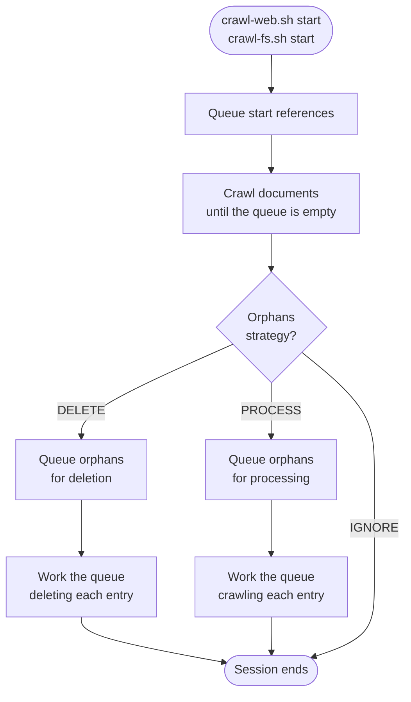
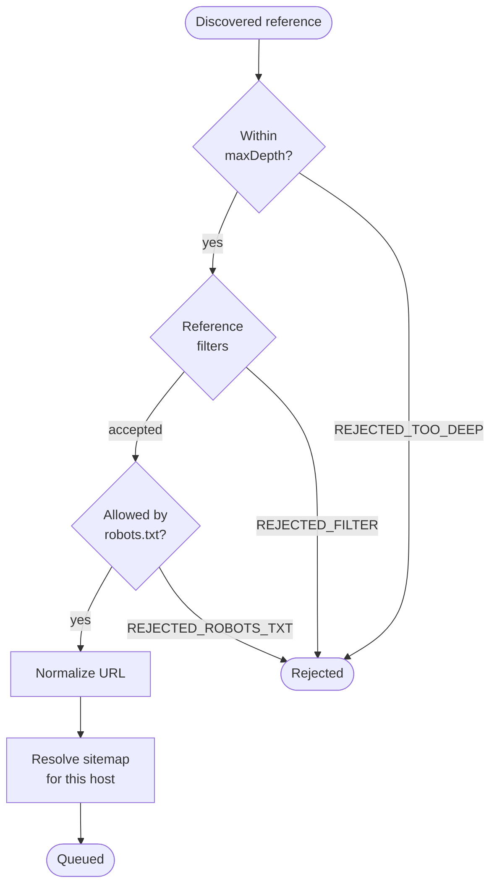
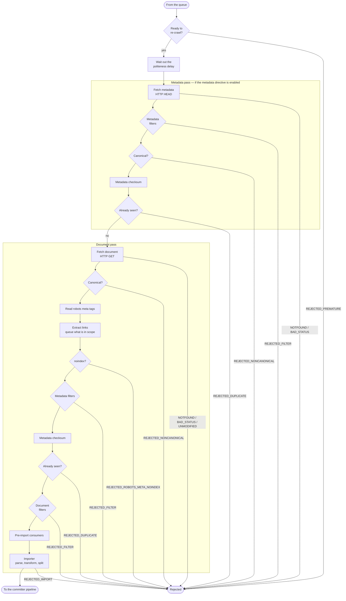
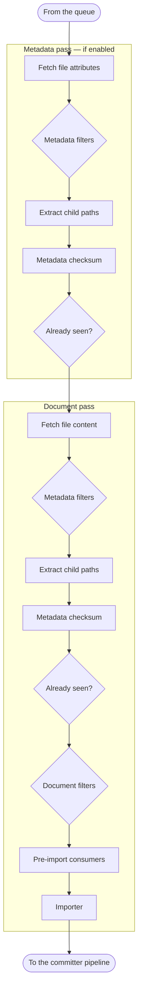
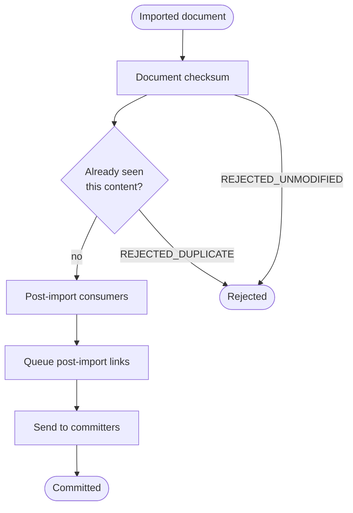

# Crawler Flow

This page traces what actually happens to a reference, from the moment it is
queued to the moment it reaches your destination. It is the detailed companion
to [Crawl Pipeline](./crawl-pipeline.md), which covers the same ground in three
stages instead of thirty.

The flow is shown at four levels of zoom:

1. [The crawl session](#the-crawl-session) — the whole arc, start references to orphans
2. [The queue pipeline](#the-queue-pipeline) — how a reference earns its place in the queue
3. [The document pipeline](#the-document-pipeline) — fetching, filtering, and importing
4. [The committer pipeline](#the-committer-pipeline) — what happens on the way out

:::tip Working with these diagrams
Drag to pan, <kbd>Ctrl</kbd>+scroll (or pinch) to zoom, and use the toolbar to
reset or go full screen. **Click any stage to jump to its description.**

Amber marks what comes in, blue the crawler's own stages, green what leaves
successfully, and red anything dropped along the way.
:::

Every stage named here is a real class in the crawler source, and the order
shown is the order they are registered in `WebDocPipelines` and `FsPipelines`.

## The crawl session

A session queues the start references, works the queue until it is empty, and
then decides what to do about documents it saw last time but not this time.

The arc below is the session, not necessarily a single execution. If the crawler
is stopped or interrupted part-way, the next `crawl-web.sh start` (or
`crawl-fs.sh start`) resumes the same session and carries on from where it
stopped — see [Crawl Sessions and Runs](./sessions.md).

### Queue start references

Reads `startReferences` and pushes each one through the
[queue pipeline](#the-queue-pipeline). This step deliberately runs on a **single node** even
in a cluster — the queue has to exist before anyone can work it.

Skipped when a session is being resumed: the queue is restored from the ledger
instead, so a resumed session never re-reads `startReferences`.

### Crawl documents

The main loop: pull an entry from the queue, run it through the
[document pipeline](#the-document-pipeline), then the [committer pipeline](#the-committer-pipeline), and
repeat until the queue is empty. This step is **distributed** — in a cluster
every node runs it against the shared queue, which is the whole of what
clustering changes about the flow. Nothing else on this page differs between a
standalone and a clustered run.

### Orphan handling

An **orphan** is a document present in the previous crawl session but not reached
in this one — typically because nothing links to it any more. This stage runs
when the session reaches its end, so a run that stops early never gets here.
What happens next is set by `orphansStrategy`:

| Strategy | Effect |
| --- | --- |
| `IGNORE` | Leave them alone. The session ends after the main crawl. |
| `DELETE` | Requeue them, then send a delete to every committer. |
| `PROCESS` | Requeue them and crawl them again, in case they are still live. |

Orphan requeueing is skipped entirely on an incremental session configured with
`changeDiscovery: SOURCE_DELTA`, because in that mode the absence of a
reference does not prove the document is gone.

## The queue pipeline

Before a reference is queued it has to survive this. The web crawler adds four
web-specific stages the file system crawler has no use for; the rest is shared.

The file system crawler runs only **depth validation → reference filters →
queue**. Sitemaps, `robots.txt`, and URL normalization have no file system
equivalent.

### Depth validation

Rejects the reference if its depth exceeds `maxDepth`. A `maxDepth` below zero
means unlimited. Depth is counted from the start references, not from the site
root. Rejects as `REJECTED_TOO_DEEP`.

### Reference filters

Applies your `referenceFilters` to the reference string alone — no request has
been made yet, so this is the cheapest place to exclude anything you know you do
not want. Rejects as `REJECTED_FILTER`.

### robots.txt rules

_Web crawler only._ Applies the `Disallow` and `Allow` directives from the
site's `robots.txt`. Skipped entirely if you unset `robotsTxtProvider`. Rejects
as `REJECTED_ROBOTS_TXT`.

### URL normalizer

_Web crawler only._ Runs the configured `urlNormalizers`, so that the same page
reached by differently-written URLs is crawled once. The original URL is kept on
the entry's reference trail.

### Sitemap resolution

_Web crawler only._ On first contact with a host, tries to locate and read its
sitemap, adding what it finds to the queue. The result is cached per host so
this happens once per site, not once per URL. Skipped for references that came
from a sitemap in the first place.

### Queue the reference

Writes the entry to the crawl ledger. The ledger is what persists across
stop/start, and in a cluster it is shared by every node.

## The document pipeline

This is the long one. Its shape is driven by **fetch directives**: the crawler
can make a cheap metadata-only request first (an HTTP `HEAD`, or a file
attribute read) and decide from the response whether the full document is worth
fetching at all.

Stages marked *once only* run in the metadata pass when it is enabled, and in
the document pass when it is not — never twice.

### Recrawlable resolver

_Web crawler only._ On an incremental session, asks the `recrawlableResolver` whether this
document is due to be fetched again — from sitemap `changefreq`/`lastmod`, or
from the minimum frequencies you configure. Documents that are not due are
dropped here, before any request is made. Rejects as `REJECTED_PREMATURE`. See
[Crawl Sessions and Runs](./sessions.md#controlling-re-crawl-eligibility-web-crawler-only).

### Delay resolver

_Web crawler only._ Blocks until the configured politeness delay for this site
has elapsed. This is the stage that keeps the crawler from hammering a host.

### Fetch

Runs the configured fetchers for the current directive — an HTTP `HEAD` or `GET`
for the web crawler, a metadata or content read for the file system crawler. A
stage whose directive is disabled does nothing. Rejects as `REJECTED_NOTFOUND`
or `REJECTED_BAD_STATUS`; the document fetch may also reject as
`REJECTED_UNMODIFIED` when the server answers `304`.

### Metadata filters

_Once only._ Applies your `metadataFilters` to whatever fields are known so far.
With the metadata directive enabled, this is your chance to reject a document
from its headers alone — before spending a `GET` on it. Rejects as
`REJECTED_FILTER`.

### Canonical check

_Web crawler only._ If the document declares a different URL as canonical, this
copy is rejected and the canonical one is queued instead. Runs after both the
`HEAD` (`Link` header) and the `GET` (`<link rel="canonical">`). Rejects as
`REJECTED_NONCANONICAL`.

### Metadata checksum

_Once only._ Computes a checksum from the metadata using the configured
`metadataChecksummer`. On an incremental session, an unchanged checksum means the
document is skipped as `REJECTED_UNMODIFIED`.

### Metadata dedup

_Once only._ If deduplication is on, checks whether another document in this
same session already produced this metadata checksum. Rejects as
`REJECTED_DUPLICATE`.

### Robots meta tags

_Web crawler only._ Reads the page's robots directives — the `<meta name="robots">`
tag and `X-Robots-Tag` header — in one stage, then acts on `noindex` in another.
The gap between them is deliberate: link extraction sits in between, so a page
marked `noindex` can still contribute its links unless it is also `nofollow`.
Rejects as `REJECTED_ROBOTS_META_NOINDEX`.

### Link extraction

_Web crawler only._ Pulls links from the document and sends the in-scope ones
back to the [queue pipeline](#the-queue-pipeline). This runs **before** the importer on
purpose: importing may rewrite or strip content, and links found in the original
markup would be lost by then.

### Document filters

Applies your `documentFilters`, which unlike metadata filters can inspect the
content itself. Rejects as `REJECTED_FILTER`.

### Pre-import consumers

Runs any `preImportConsumers` you have configured — arbitrary code with access
to the fetched document, just before parsing. Fires `DOCUMENT_PREIMPORTED`.

### Import

Hands the document to the **Importer**: parsing, transformers, splitters, and
conditions. This is a pipeline in its own right — see
[Document Processing](./document-processing.md). A document the Importer rejects
comes back as `REJECTED_IMPORT`.

### The file system pipeline

Same skeleton, minus everything web-specific, plus one stage of its own:

#### Child path extraction

_File system crawler only._ When the reference is a folder, lists its children
and queues them. It sits immediately after the metadata filters so that
rejecting a folder also skips everything inside it — filter out
`/archive/` once and its whole subtree is never listed.

## The committer pipeline

The document has been imported. What is left is deciding whether it is worth
sending, and sending it.

### Document checksum

Computes a checksum over the imported content using `documentChecksummer`. On an
incremental session this is the last and most reliable chance to notice the document
has not actually changed, since it is based on parsed content rather than
headers. Rejects as `REJECTED_UNMODIFIED`.

### Document dedup

Catches two different references whose *content* is identical — the same
document served under two URLs, or the same file in two folders. Rejects as
`REJECTED_DUPLICATE`.

### Post-import consumers

Runs any `postImportConsumers`: your code, with the finished document, right
before it is handed over. Fires `DOCUMENT_POSTIMPORTED`.

### Post-import links

_Web crawler only._ Queues URLs found in metadata fields matching
`postImportLinks`. This is how links produced *by* the importer — extracted from
a PDF, say — get crawled, having appeared too late for the
[link extraction stage](#link-extraction).

### Send to committers

Hands the document to every configured committer as an **upsert**. Deletions
take a shorter path: an orphan queued for deletion goes straight to the
committers without an import. See [Integrations](/integrations) for the
available destinations.

## Rejection outcomes

Every rejection above fires an event you can listen for. Useful when a document
you expected is missing and you need to know which stage dropped it — each event
carries the reference and the filter or stage responsible.

| Event | Meaning |
| --- | --- |
| `REJECTED_TOO_DEEP` | Beyond `maxDepth`. |
| `REJECTED_FILTER` | A reference, metadata, or document filter said no. |
| `REJECTED_ROBOTS_TXT` | Disallowed by the site's `robots.txt`. |
| `REJECTED_ROBOTS_META_NOINDEX` | The page asked not to be indexed. |
| `REJECTED_NONCANONICAL` | Another URL is the canonical one. |
| `REJECTED_PREMATURE` | Not yet due for re-crawl. |
| `REJECTED_NOTFOUND` | `404`, or the file is gone. |
| `REJECTED_BAD_STATUS` | Any other unusable response. |
| `REJECTED_UNMODIFIED` | Unchanged since the last crawl. |
| `REJECTED_DUPLICATE` | Same checksum as another document this session. |
| `REJECTED_IMPORT` | The Importer rejected it, usually via a `Reject` handler. |
| `REJECTED_ERROR` | Something threw. |

To act on these, register an event listener — see
[Extending the Crawler](./extending.md).
