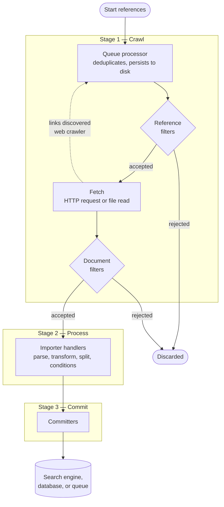

# Crawl Pipeline

Every document processed by Norconex Crawler — whether a web page or a file
system file — moves through the same three-stage pipeline.

Understanding this pipeline is the key to configuring and extending the crawler
effectively. For the stage-by-stage version — every filter, checksum, and
rejection point, in diagrams you can zoom into — see
[Crawler Flow](./crawl-flow.md).

**Filtering** is not a separate stage — it is a cross-cutting capability
available at multiple checkpoints within the pipeline, letting you discard
unwanted references or documents before and after each major step.

## Stage 1: Crawl

The crawler discovers and fetches documents from the configured sources.

- **Web Crawler**: Makes HTTP/S requests, follows links discovered in pages,
  respects `robots.txt` and `sitemap.xml` directives by default.
- **File System Crawler**: Traverses directory trees, connects to remote
  systems (FTP, SFTP, HDFS, S3, ...).

Filtering happens at two checkpoints within this stage:

- **Reference filters** — applied to each discovered URL or path _before_
  fetching. References that don't pass are never fetched.
- **Document filters** — applied to fetched content and metadata _after_
  fetching. Documents that don't pass are discarded before processing.

### Queue management

Before fetching, each candidate reference passes through a **queue processor**:

- Already-visited references are skipped (deduplication by URL or checksum)
- The queue persists to disk, enabling crawl resume after interruptions

## Stage 2: Process (Import)

Accepted documents enter the **Importer**, a configurable sub-pipeline that
parses content, enriches metadata, and reshapes documents before they are
committed. The Importer can also be used as a standalone library outside the
crawler.

See [Document Processing](./document-processing) for the full details of
available handlers and configuration.

## Stage 3: Commit

The final stage sends processed documents to one or more **Committers**.

A committer is a plugin that writes to a specific destination:
Elasticsearch, Solr, SQL, Kafka, Neo4j, Azure, and others.

Committers receive a standardized document object (reference, content,
metadata map) and handle destination-specific protocols.
Multiple committers can run in parallel for the same crawl session.

## Where to configure each stage

All configurable options are described in the [Reference](/docs/reference/)
section.

The [Visual Configurator](https://configurator.norconex.com) makes it
easy to configure every pipeline stage.

All stages are configurable in a YAML, JSON, or XML config file.
