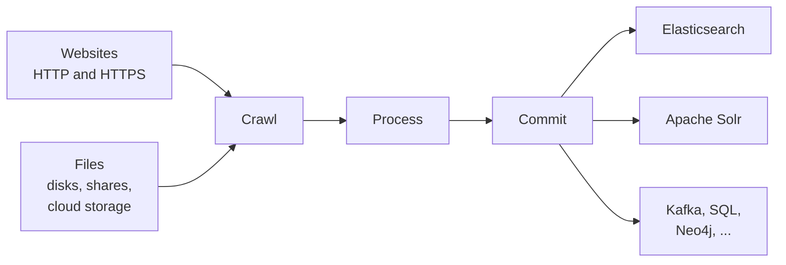

# Concepts

This section explains how Norconex Crawler works conceptually.
Understanding these ideas will help you configure and extend the crawler effectively.

## Topics in this section

| Topic                                                       | What it covers                                           |
| ----------------------------------------------------------- | -------------------------------------------------------- |
| [Crawl Pipeline](./crawl-pipeline.md)                       | How documents move from source to destination            |
| [Crawler Flow](./crawl-flow.md)                             | The same journey stage by stage, in interactive diagrams |
| [Sessions](./sessions.md)                                   | Resumable crawl state, deduplication, and recrawl policy |
| [Configuration Semantics](./configuration-semantics.md)     | Defaults, null/empty behavior, variables, and fragments  |
| [Document Processing](./document-processing.md)             | The Import module: parsing, enrichment, metadata         |
| [Extending the Crawler](./extending.md)                     | Custom components, SPI, event listeners                  |

## The big picture

Raw content enters from the left (amber), moves through the crawler's own
stages (blue), and lands structured in your destinations (green).

Every document — whether a web page or a file — passes through the same
three-stage pipeline. The crawl type (Web vs. File System) only affects the
**Crawl** stage. Everything downstream is identical.

## Configuration model

All configuration lives in a single file (XML, YAML, or JSON).

- [Reference](/docs/reference/) — all built-in extension points with examples
- The [Visual Configurator](https://configurator.norconex.com) provides a visual way to build and validate configs.

## File System Fetcher Start References

For filesystem crawling, the most common first issue is choosing the right
start reference scheme for the fetcher you want to use.

Use [FS Fetchers Quickstart](../getting-started/fs-fetchers-quickstart.md)
for a compact table covering all supported filesystem fetchers, including
start reference examples and the first configuration step for each.
