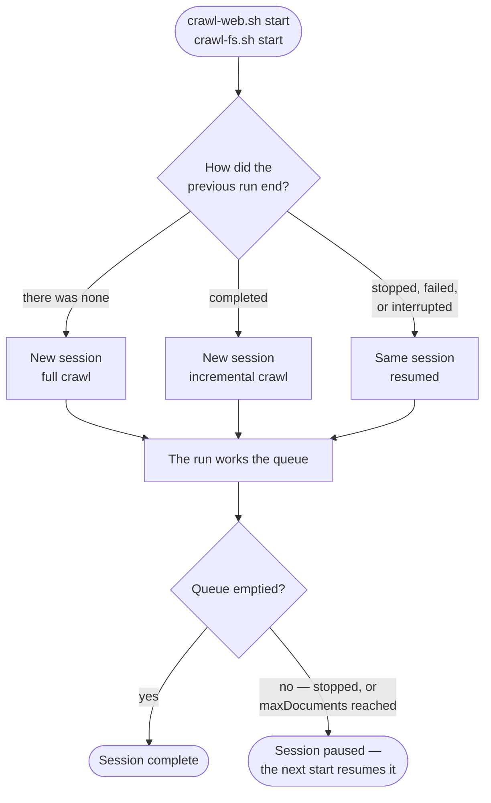

# Crawl Sessions and Runs

Two things are easy to confuse, and most questions about resuming, scheduling,
and document limits come down to telling them apart.

**Crawl session** — one complete pass over everything the crawler is configured
to reach: queueing the start references, working through every document
discovered from them, handling orphans, and finishing. A session is the unit of
**work**.

**Crawl run** — one execution of the crawler, from `start` until the process
terminates. A run is the unit of **execution**.

A session that is never interrupted takes exactly one run. A session that is
stopped, interrupted, or capped takes several — each `start` picks up the same
session where the previous run left off. **One session, one or more runs.**

Both are tracked and logged: a session carries a `crawlSessionId`, and each run
within it carries its own `crawlRunId`.

## What happens when you start the crawler

The crawler decides between resuming and starting fresh by looking at how the
previous run of that crawler ended. You never choose this — it is inferred.



| Previous run ended | Next start | Crawl mode |
| ------------------ | ---------- | ---------- |
| Never ran, or state was cleaned | New session | Full |
| Completed | New session | Incremental |
| Stopped with `stop` | Resumes the same session | Carried over |
| Failed, or the process was killed | Resumes the same session | Carried over |

## Full and incremental crawls

A **full** crawl treats every document as new. An **incremental** crawl compares
what it finds against what the previous crawl recorded, and commits only what was
added, changed, or removed.

**Incremental crawling happens between sessions, not between runs.** When a
session completes, its record of every document it processed is set aside as the
baseline. The next session compares against that baseline and commits the
differences. A crawler's first session has no baseline, so it is always full;
every session after it is incremental.

Runs do not each get their own baseline. A session that is stopped and resumed
five times still compares against a single snapshot — the one left by the last
*completed* session. Two consequences worth knowing:

- **Stopping mid-crawl is safe.** A half-finished session is never mistaken for
  a site that lost most of its documents, because nothing is compared until the
  session finishes.
- **Orphan handling waits for the end of the session.** An
  [orphan](./crawl-flow.md#orphan-handling) is a document in the baseline that
  this *session* never reached, so orphan deletion cannot be triggered by a run
  that stops early — the crawler exits before that stage.

Resuming also carries the crawl mode over, so a resumed run of a full crawl
stays a full crawl.

## What resumed runs skip

A resumed run does **not** re-read `startReferences`. The queue is restored from
the persisted ledger instead, along with everything already discovered, and the
run continues from there. Documents processed by earlier runs of the same
session are not processed again.

This is why editing `startReferences` has no effect on a session already in
progress — the new entries are picked up when the next session begins.

## Session identity

Every crawler configuration has an `id` field. This ID is used as the name of
the state directory under the configured `workDir`.

```yaml
id: acme-website # ← crawler identity
workDir: /var/crawler/state
startReferences:
  - https://www.example.com
```

Two configs with the same `id` and `workDir` share the same state, and therefore
the same session history. Changing the `id` or deleting the `workDir` starts a
fresh session with a full crawl.

## Start, stop, and resume

| CLI command    | Effect                                                        |
| -------------- | ------------------------------------------------------------- |
| `start`        | Begin a new session, or resume an unfinished one              |
| `stop`         | Gracefully end the current run — in-flight documents finish, state is saved, the session stays open |
| `start -clean` | Discard all state, then start — a new session, crawled in full |
| `clean`        | Discard all state without starting                            |

`stop` ends a *run*, not a session. Unvisited references stay queued and
already-committed documents are not re-committed, so the next `start` continues
rather than restarting.

To abandon a session part-way rather than resume it, clean the state first —
otherwise the next `start` will always try to finish what was left open.

## Limiting documents per run

`maxDocuments` caps how many documents a single **run** processes, not a
session. When a run hits the cap it stops, but the session is not considered
complete: the next run resumes it with a fresh allowance of the same size.

This makes the setting a chunking control. With `maxDocuments: 10000`, a large
site can be crawled ten thousand documents at a time across as many runs as it
takes, and the session completes only once the queue empties. To avoid resuming
a partial session, clean the state first.

## Deduplication

The crawler tracks every document it has processed. On an
[incremental session](#full-and-incremental-crawls), it detects whether a
document has changed using techniques such as:

- **Checksum-based** (default): compare a hash of the document's content or metadata
- **Modified date**: compare the `Last-Modified` HTTP header or file system timestamp
- **ETag**: use HTTP ETags for web resources

Unchanged documents are skipped. Only new or modified documents are committed.
Deleted documents (no longer reachable) can optionally trigger a delete event
on the committer.

## Scheduling (external)

The crawler has no built-in scheduler. Use an external one — cron, a systemd
timer, a Kubernetes CronJob, or similar — to invoke `crawl-web.sh start` (or
`crawl-fs.sh start`) on a schedule.

Each scheduled invocation is a run. Whether it also begins a new session depends
on the previous one: if the last session completed, the invocation starts a new
incremental session; if it did not, the invocation resumes it. Either way, only
new or changed documents are committed.

### Controlling re-crawl eligibility (Web Crawler only)

On an incremental session, the web crawler can skip documents that are not yet
due to be re-crawled. This is controlled by the `recrawlableResolver` setting.
Documents the resolver marks as not ready are skipped entirely — no HTTP request
is made and they are not committed.

This is a **recrawl eligibility/timing policy**, not a job scheduler. It only
decides whether a given document should be fetched again during a crawl that has
already started.

The default resolver, `GenericRecrawlableResolver`, supports two mechanisms:

- **Sitemap directives** — reads `changefreq` and `lastmod` from `sitemap.xml`
  to decide recrawl eligibility (enabled by default, checked first).
- **Minimum frequencies** — define per-URL-pattern or per-content-type
  minimums using values like `daily`, `weekly`, `monthly`, or a millisecond count.

```yaml
recrawlableResolver:
  class: GenericRecrawlableResolver
  sitemapSupport: FIRST # FIRST (default), LAST, or NEVER
  minFrequencies:
    - applyTo: REFERENCE
      matcher:
        pattern: ".*\\.pdf$"
      value: weekly
    - applyTo: REFERENCE
      matcher:
        pattern: ".*"
      value: daily
```

The File System Crawler has no equivalent — all reachable documents are
evaluated on every crawl (deduplication still skips unchanged ones).

## State storage

By default, state is stored in an embedded key-value store in the `workDir`.
For clustered deployments, the state backend can be replaced with a distributed
store (e.g., Hazelcast, JDBC).
See the [Configuration Reference](/docs/reference/) for storage backends.

In a cluster, a run spans the nodes taking part in it: nodes joining a run
already in progress share its `crawlRunId` rather than starting one of their own.

:::note[A note on the API]
The Java class `CrawlerSession` and the `CRAWLER_SESSION_BEGIN` /
`CRAWLER_SESSION_END` events are scoped to a single **run**, not to a crawl
session as defined on this page — they fire once per execution of the crawler.
To follow the session across runs, read `crawlSessionId` from the run
information.
:::
